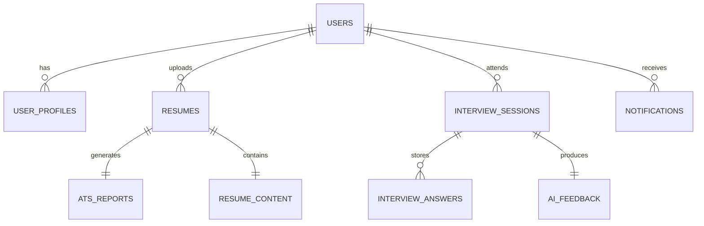

# Entity Relationship Diagram

```mermaid
erDiagram

USERS ||--o{ USER_PROFILES : has
USERS ||--o{ RESUMES : uploads
USERS ||--o{ INTERVIEW_SESSIONS : attends
USERS ||--o{ NOTIFICATIONS : receives

RESUMES ||--|| ATS_REPORTS : generates
RESUMES ||--|| RESUME_CONTENT : contains

INTERVIEW_SESSIONS ||--o{ INTERVIEW_ANSWERS : stores
INTERVIEW_SESSIONS ||--|| AI_FEEDBACK : produces
```